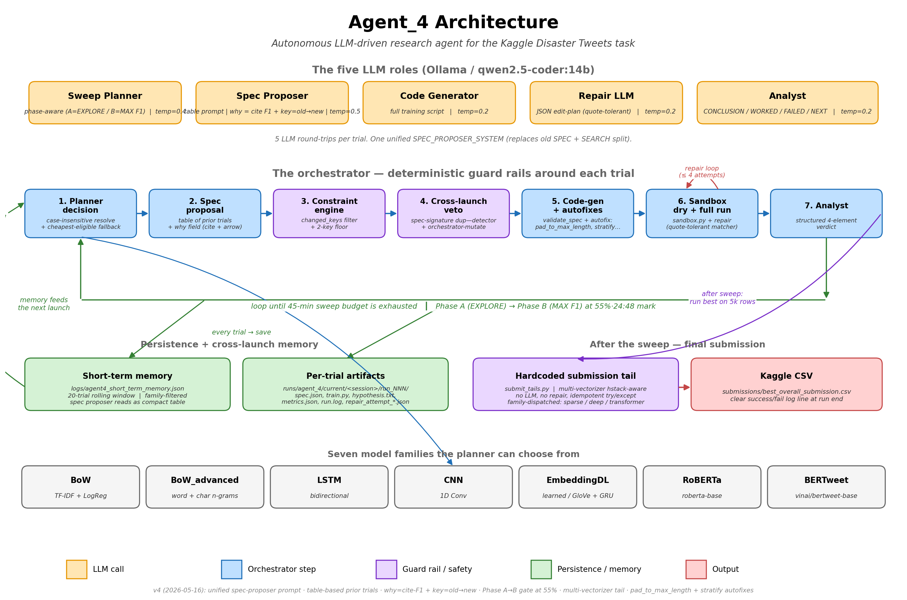

# APA Disaster Tweets — Autonomous LLM Research Agent

## To run everything

```bash
./run.sh
```

That's it. The script handles the virtualenv, installs dependencies, checks Ollama is up, pulls the `qwen2.5-coder:14b` model on first run (~9 GB, one-time), verifies the dataset is in place, and launches the agent for the default 60-minute budget.

Useful variants:

```bash
./run.sh --time-budget-minutes 10      # quick smoke run
./run.sh --family bertweet             # one trial of a specific family
./run.sh dashboard                     # serve the live dashboard at http://localhost:5050
```

---

## What this is

The Kaggle competition [`nlp-getting-started`](https://www.kaggle.com/competitions/nlp-getting-started) asks for binary classification of tweets — disaster (label 1) vs not (label 0). Rather than solving it by hand, this project is an **autonomous research agent** that uses a local LLM (Ollama-hosted) to plan experiments, write training code, repair the code when it breaks, and interpret the results — all inside a 1-hour CPU-only budget. Every trial is recorded as `hypothesis → spec → F1 → conclusion`, and the next trial reads that history before deciding what to try next.



Full design rationale, experiment log, results, and reflections are in the project report. This README is the practical reference — what the agent is, how it works, and how to run it.

---

## What one trial looks like

A single launch loops through trials. Each trial runs through **five LLM round-trips** plus **nine deterministic guard rails**:

1. **Memory load.** The agent reads `logs/agent4_short_term_memory.json` — a rolling window of the last 20 trials from previous launches, with their specs, F1s, hypotheses, and analyst conclusions.

2. **Pick a family.** The *sweep planner* LLM (temperature 0.4) picks which of the seven model families to try next. Its user prompt opens with a hard-gated **phase header** — Phase A (EXPLORE) for roughly the first 55% of the sweep window, then Phase B (MAXIMISE F1) for the remainder. Phase A asks the LLM to cover untried families; Phase B asks it to drill the current leader and substitutes the leader's actual family + F1 into the prompt live. The phase boundary is set by the orchestrator's wall-clock gate, not by the LLM's judgement. Family names are matched case-insensitively, so `BoW_advanced` from the LLM resolves to canonical `bow_advanced`.

3. **Propose an experiment.** The *spec proposer* LLM (temperature 0.5) writes a JSON object with three fields: `why` (one short sentence with TWO halves — cite a prior F1 from the table AND name the keys you are CHANGING in `key=old→new` arrow notation), `changed_keys` (the list of tunable keys it intends to change), and the spec values. The user prompt gives the LLM a **compact PRIOR TRIALS table** (one row per prior trial of this family, showing F1 + tunable spec + outcome + plateau flag) instead of the narrative dump used in earlier versions. The narrative dump was a copy-paste vector — the LLM kept pasting prior hypothesis text verbatim, including stale F1 numbers. The table format is harder to copy and easier to reason from.

4. **Constrain.** The orchestrator constrains the experiment to **only** the keys the LLM declared in `changed_keys`. Silent changes are reverted to the anchor (default spec on first trial, prior best on revisits). A 2-key minimum floor applies — if the LLM declared fewer, the orchestrator backfills additional keys and tags them with `[orchestrator-added: ...]` in the hypothesis so the record stays honest.

5. **Cross-launch veto.** If the final spec signature exactly matches a prior-launch trial of the same family, the orchestrator mutates further so we don't burn a trial on a known result. The mutated hypothesis is prefixed `[orchestrator-generated]` and names the keys it changed plus the prior best F1 for that family.

6. **Generate the code.** The *code-generator* LLM (temperature 0.2) writes a complete Python training script from the validated spec.

7. **Run it.** The script executes in a CPU subprocess sandbox: 60-second dry run on a tiny data slice first, then the real 1000-second run on the sweep sample. If anything crashes, the *repair* LLM (temperature 0.2) returns a structured JSON edit-plan — up to 4 repair attempts.

8. **Analyse.** The *analyst* LLM (temperature 0.2) reads the metrics + spec + hypothesis and writes a structured CONCLUSION / WHAT WORKED / WHAT FAILED / NEXT MOVE.

9. **Persist + repeat.** The trial — hypothesis, spec, F1, conclusion — gets saved to the rolling 20-trial memory and to per-trial artifact files. The next iteration reads everything that just happened.

After the 45-minute sweep window ends, the orchestrator picks the highest-F1 trial across all families, reloads its training script, appends a **hardcoded** inference tail (no LLM at this step, no repair attempts — past repair attempts on the final submission corrupted the tail), retrains on a 5 000-row sample, and writes `submissions/best_overall_submission.csv` for Kaggle. The sparse-family tail is **multi-vectorizer aware**: it inspects the classifier's `n_features_in_` and either picks the single matching vectorizer (BoW) or `hstacks` all of them in order (BoW_advanced uses word + char concatenation). Wall-clock total: 60 minutes by default (45 min sweep + ~15 min final retrain).

At the very end the orchestrator prints a single explicit status line so the live log is unambiguous:

```
[Sweep Best] family=RoBERTa | run=1 | metrics={f1: 0.7928, ...}
[Final Submission ✓] f1=0.8088 (5K retrain) | sweep_best=0.7928 | csv=/path/to/submissions/best_overall_submission.csv
```

— or on failure:
```
[Final Submission ✗] CSV not written or invalid. Expected: /path/...
  error tail: <last 300 chars of stderr>
```

The planner never ends the sweep itself — only the wall-clock deadline does. If the planner LLM emits `"stop"`, the orchestrator logs `[Sweep Planner] Ignoring 'stop' action — sweep continues until the wall-clock deadline.` and re-queries.

---

## The eleven mechanism layers

| # | Layer | What it does | Where |
|---|---|---|---|
| 1 | **Cross-launch short-term memory** | Persists the last 20 trials across launches (spec + F1 + analyst conclusion). Family-filtered into the spec proposer's prompt as a compact table. | `short_term_memory.py` |
| 2 | **Phase A → Phase B wall-clock gate** | Hard-coded transition at `PHASE_B_FRACTION * SWEEP_DURATION_SECONDS` (default 55% → 24:48 of a 45-min sweep). Flips the planner prompt's goal header from EXPLORE to MAXIMISE F1 and substitutes the current leader's family + F1 into the prompt. The LLM still picks the family freely from the eligible list — only the goal framing flips. | `agent.py:86`, `sweep_planner.py:_phase_header` |
| 3 | **Table-based spec-proposer prompt** | The spec proposer sees prior trials as a compact `F1 \| tunable spec \| source \| outcome` table (plus a `PLATEAUED KEYS` line) instead of the old narrative dump with prior hypothesis + verdict text. The narrative was the main copy-paste vector — replacing it with a table eliminates verbatim borrowing of stale F1 numbers. | `generate_spec.py:format_prior_trials_table` |
| 4 | **`why` field with TWO halves** | The spec proposer's `why` must (1) cite a prior F1 from the table and (2) name the keys+values being CHANGED in `key=old→new` arrow notation. Anchor-default values (unchanged from the spec the LLM is mutating) explicitly do NOT count. | `prompts.py:SPEC_PROPOSER_SYSTEM` |
| 5 | **`changed_keys` hypothesis-as-source-of-truth** | The LLM must declare which tunable keys it changes; silent changes are reverted to the anchor. Eliminates "I claim 1 change but actually changed 5" hallucination. | `generate_spec.py`, `search.py` |
| 6 | **2-key minimum floor + `[orchestrator-added: …]` annotation** | Final spec must differ from the anchor on at least 2 tunable keys. If the LLM declared fewer, the orchestrator backfills and appends the added keys to the `why` so the research record stays truthful. | `search.py:_ensure_phase_mutation`, `generate_spec.py` |
| 7 | **Cross-launch veto** | If the final spec signature matches a prior-launch trial of the same family, the orchestrator mutates further. The orchestrator-generated hypothesis names the mutated key and the cross-launch best F1 it's trying to beat. | `agent.py:execute_family` |
| 8 | **Per-call temperature split** | Spec proposer = 0.5 (creative but bounded by the validator); planner = 0.4; everything else (code-gen, repair, analyst) = 0.2. | `llm.py` |
| 9 | **Plateau detection** | A family whose last 2 successful trials are within F1 ±0.005 of its best is dropped from eligibility (`PLATEAU_WINDOW=2`, `PLATEAU_TOLERANCE=0.005`). | `sweep_planner.py:72-73` |
| 10 | **Code autofixes (HF families)** | Deterministic regex fixes applied BEFORE preflight: `pad_to_max_length=True → padding="max_length"` (variable-length tensor crash), malformed `try: stratify_labels = … except` indentation (SyntaxError fixer). | `experiment_hf_classifier.py:apply_light_autofixes` |
| 11 | **Quote-tolerant repair matcher** | The repair LLM frequently emits `target` snippets with the wrong quote style (`'x'` vs `"x"`). The matcher treats `'` and `"` as interchangeable so a correct diagnosis isn't lost to a quote mismatch. | `repair.py:_find_flexible_span` |
| 12 | **Multi-vectorizer-aware submission tail** | The sparse tail finds ALL fitted vectorizers in scope, checks the classifier's `n_features_in_`, and either picks a single matching vectorizer (BoW) or `hstacks` all of them (BoW_advanced word+char). Logs which vectorizer(s) were used. | `submit_tails.py:SPARSE_TAIL` |
| 13 | **Spec validator** | Resets out-of-range numeric values to the family default, strips fixed/non-tunable keys, coerces types. Out-of-range never produces a "wild" value — it produces the safe default. | `validate_spec.py` |
| 14 | **Hardcoded submission tail** | At final-submission time, the orchestrator appends a deterministic Python tail (not LLM-written) that loads the model, predicts the test set, and writes the CSV. Wrapped in `try/except` with idempotent markers. Family-dispatched: sparse / deep / transformer. | `submit_tails.py` |

---

## The five LLM roles

All five run through `OllamaClient` in `llm.py`, against the same model (`qwen2.5-coder:14b` by default). Each call passes the appropriate `temperature` and a different system prompt.

| Role | System prompt | Temperature | What it returns |
|---|---|---|---|
| Sweep planner | `SWEEP_PLANNER_SYSTEM` | **0.4** | JSON: `try_family` (primary) or `skip_family_permanently`. `stop` is ignored by the orchestrator. Phase A/B header at top of user prompt sets the goal. |
| Spec proposer | `SPEC_PROPOSER_SYSTEM` | **0.5** | JSON: `why` + `changed_keys` + spec values. ONE unified prompt used for both first-trial and revisit calls; the user prompt names which anchor (family default / current best) and shows the same compact table either way. |
| Code generator | `FULL_SYSTEM` | 0.2 | one ```python``` block — a full training script |
| Surgical repair | `PATCH_REPAIR_SYSTEM` | 0.2 | JSON edit-plan (`replace` / `insert_before` / `insert_after`). Matcher is quote-tolerant. |
| Analyst | hardcoded | 0.2 | structured CONCLUSION / WHAT WORKED / WHAT FAILED / NEXT MOVE |

Spec calls (0.5) and the planner (0.4) need creativity — proposing genuinely new hyperparameter combinations and reasoning over memory. Code generation, repair, and the analyst stay at 0.2 (determinism — one wrong token in Python is a syntax error). The planner's goal is split by a **hard wall-clock gate**: Phase A (≈first 55% of the sweep) optimises for coverage; Phase B (remainder) optimises for F1 above the current leader.

---

## The seven model families

| Family | Approach | Tunable keys |
|---|---|---|
| BoW | sklearn TF-IDF + LogReg | `max_features, ngram_max, min_df, logreg_c, threshold_*` |
| BoW_advanced | word + char TF-IDF + LogReg | `word_max_features, char_max_features, word_ngram_*, char_ngram_*, min_df, logreg_c, threshold_*` |
| LSTM | PyTorch bidirectional LSTM | `max_vocab, max_len, embedding_dim, hidden_dim, num_layers, dropout, batch_size, epochs, learning_rate` |
| CNN | PyTorch 1D Conv | `max_vocab, max_len, embedding_dim, channels, dropout, batch_size, epochs, learning_rate` |
| EmbeddingDL | learned/GloVe embedding + GRU | `embedding_source, max_vocab, max_len, embedding_dim, hidden_dim, dropout, batch_size, epochs, learning_rate` |
| RoBERTa | `roberta-base` fine-tune | `max_len, train_batch_size, eval_batch_size, learning_rate, weight_decay, num_epochs` |
| BERTweet | `vinai/bertweet-base` fine-tune | same as RoBERTa |

Per-family files in `src/Agent_4/families/`. RoBERTa and BERTweet share `experiment_hf_classifier.py` as a base.

---

## Live terminal output

While the agent runs, you see tagged lines telling you which stage of the loop it's in:

```
[Memory] Loaded 20 prior-launch trial(s) from logs/agent4_short_term_memory.json
[Memory] By family: BoW_advanced:8, CNN:2, ...  |  best so far BERTweet F1=0.7914
[LLM] Request started | model=qwen2.5-coder:14b | temp=0.4 | timeout=1000s | prompt='Decide the next sweep action.'

# Phase A (early in the sweep): planner covers untried families
[Sweep Planner] action=try_family family=bertweet reason=bertweet is an untried family and exploring it aligns with the Phase A goal of covering families this launch.
[LLM] Request started | model=qwen2.5-coder:14b | temp=0.5 | timeout=1000s | prompt='Propose the next BERTweet spec.'
[Hypothesis] Prior F1=0.7914 with max_len=128, lr=1.5e-5; changing lr=1.5e-5→1e-5, max_len=128→144 to push above 0.7914.
[Diversity] Cross-launch duplicate detected — mutating spec.       ← only when veto fires
[EXECUTE] Running experiment...
  [Sandbox] Dry run passed. Starting metrics-only run...
[Result] run 1/1 | success=True | metrics={'f1': 0.7812, ...}
[Conclusion] Hypothesis refuted; F1 dropped from 0.7914 to 0.7812.
[Best] family=BERTweet | run=1 | metrics={'f1': 0.7812, ...}

# At the 24:48 mark the orchestrator flips the planner's goal:
[Sweep] *** PHASE A → PHASE B transition at 1485s elapsed. Goal switches from EXPLORE to MAXIMISE F1. ***

# Phase B: planner cites concrete F1s, drills the leader
[Sweep Planner] action=try_family family=bow_advanced reason=The bow_advanced family has the second-highest bestF1 of 0.7219, within striking distance of the current leader's F1 of 0.7928; demonstrated potential to improve with parameter tweaks.

# At the end of the run, an explicit success/fail line:
[Sweep Best] family=RoBERTa | run=1 | metrics={'f1': 0.7928, ...}
[Final Submission ✓] f1=0.8088 (5K retrain) | sweep_best=0.7928 | csv=/Users/.../submissions/best_overall_submission.csv
```

The `[Sweep Planner] reason=...` text is the LLM's evidence-cited justification (Phase B forbids generic answers like "untried family" and demands a concrete F1 citation; Phase A is looser). The `[Hypothesis]` line is the spec proposer's stated experiment — note the `key=old→new` arrow notation and the `Prior F1=X` citation, both required by the unified `SPEC_PROPOSER_SYSTEM` prompt. The `[Conclusion]` line is the analyst's structured verdict. Together they form the audit trail of one trial.

---

## Trial outcome classes

`sweep_planner.classify_trial_outcome` maps every sandbox result to one of:

| Outcome | Meaning |
|---|---|
| `success` | Finished with F1 ≥ 0.4 |
| `degenerate_success` | Finished but F1 < 0.4 (one-class collapse); 2 in a row drops the family from eligibility |
| `code_gen_failed` | LLM couldn't produce a runnable script even after 4 repair patches |
| `training_crash` | Script ran but raised an exception |
| `timeout` | Exceeded the 1000 s sandbox timeout |
| `no_metrics` | Script finished without printing a `METRICS:` line |

---

## Safety nets (orchestrator-side eligibility filter)

The planner LLM can propose any family, but the orchestrator filters out:

- Hard per-family attempt cap: `MAX_ATTEMPTS_PER_FAMILY = 5`
- **2 consecutive `code_gen_failed`** with no success → family dropped
- **2 consecutive `degenerate_success`** with no success → family dropped
- Families whose estimated cost exceeds the remaining time
- Plateaued families (last 2 successes within ±0.005 F1 of best, `PLATEAU_WINDOW=2`)
- Fallback round-robin if the planner LLM is unreachable
- `stop` action from the planner is ignored — only the wall-clock deadline ends the sweep
- Family-key matching is case-insensitive — `BoW_advanced` and `bow_advanced` both resolve to the same family

---

## Repository layout

```text
.
├── README.md                     ← this file
├── requirements.txt
├── run.sh                        ← bootstrap script: venv + Ollama check + launch
├── data/
│   ├── train.csv
│   └── test.csv
├── src/
│   └── Agent_4/                  ← all agent source
│       ├── agent.py              # main orchestrator (sweep loop + final submission)
│       ├── sweep_planner.py      # planner LLM, plateau, eligibility filter
│       ├── prompts.py            # all system prompts
│       ├── generate_spec.py      # first-trial spec proposer
│       ├── search.py             # revisit spec proposer + _ensure_phase_mutation
│       ├── short_term_memory.py  # cross-launch 20-trial rolling memory
│       ├── llm.py                # Ollama client (per-call temperature)
│       ├── repair.py             # surgical JSON-patch repair
│       ├── sandbox.py            # CPU subprocess runner
│       ├── submit_tails.py       # hardcoded final-submission tail
│       ├── validate_spec.py      # type coercion + range clamping
│       ├── families/             # per-architecture hooks
│       └── templates/            # one Jinja-ish prompt template per family
├── runs/
│   └── agent_4/
│       ├── current/              ← latest committed snapshot of a live run
│       ├── before_fix/           ← archived sessions from earlier code versions
│       └── v2_fixed/ … v16_pre_2key_floor/
├── logs/
│   ├── agent4_log.json           ← in-launch write-only audit log (gitignored)
│   └── agent4_short_term_memory.json  ← 20-trial rolling cross-launch memory
└── submissions/                  ← Kaggle CSVs (filled by the agent)
```

A fresh clone of this branch already includes 20 prior trials in the cross-launch memory, so the first launch is not starting blind — the planner and spec proposer both see the prior runs' specs, F1s, hypotheses, and analyst conclusions.

---

## Configuration

| Variable | Default | Purpose |
|---|---|---|
| `AGENT4_TOTAL_TIME_BUDGET_SECONDS` | `3600` | Overall wall-clock budget |
| `AGENT4_SWEEP_DURATION_SECONDS` | `2700` (45 min) | Hard sweep cutoff |
| `AGENT4_PHASE_B_FRACTION` | `0.55` | Fraction of the sweep at which the planner's goal flips from EXPLORE to MAXIMISE F1. `0.55 × 2700 = 1485s` (≈24:48). |
| `AGENT4_FINAL_TRAIN_ROWS` | `5000` | Rows used by the final retrain step |
| `AGENT4_SWEEP_SAMPLE_ROWS` | `2000` | Rows in the fixed sweep sample |
| `AGENT4_VALIDATION_FRACTION` | `0.2` | Local val split |
| `AGENT4_MAX_ATTEMPTS_PER_FAMILY` | `5` | Hard safety cap |
| `AGENT4_SWEEP_PLANNER_MODEL` | `qwen2.5-coder:14b` | LLM for next-family decisions |
| `DISASTER_AGENT_DATA_DIR` | `data` | Where `train.csv` and `test.csv` live |
| `DISASTER_AGENT_MAX_REPAIRS` | `4` | Repair budget per trial (zero at final-submission time) |
| `DISASTER_AGENT_LLM_TIMEOUT` | `1000` | Per-call LLM HTTP timeout (seconds) |
| `AGENT4_AUTO_SUBMIT_KAGGLE` | unset | If `1`, upload `submissions/best_overall_submission.csv` to Kaggle |

---

## Outputs

| Artifact | Location |
|---|---|
| Per-trial: spec, code, metrics, log, prompts, repair attempts | `src/Agent_4/runs/<family>_<ts>/run_NNN/` (live working dir, gitignored) |
| Per-family aggregate | `<session>/summary.json` + `best_train.py` + `best_metrics.json` |
| Planner audit trail | `src/Agent_4/runs/sweep_decisions.jsonl` |
| Cross-family summary | `src/Agent_4/runs/overall_best.json` |
| Final-submission artifacts | `src/Agent_4/runs/final_submission_train.py` + `final_submission.log` |
| Kaggle-ready CSV | `submissions/best_overall_submission.csv` |
| Cross-launch memory | `logs/agent4_short_term_memory.json` |
| Snapshot committed to repo | `runs/agent_4/current/` |

`src/Agent_4/runs/` is the live working dir (gitignored). Snapshots are committed to `runs/agent_4/current/`.

---

## Prerequisites (handled by `./run.sh`)

If you skip `./run.sh` and want to set things up manually:

1. **Python 3.11+**
2. **Ollama** running locally on `http://localhost:11434` (install from <https://ollama.com/download> or `brew install ollama`, then `ollama serve` in another terminal)
3. The code-gen model pulled: `ollama pull qwen2.5-coder:14b`
4. `data/train.csv` and `data/test.csv` available (already on this branch)
5. Dependencies:

```bash
python3 -m venv .venv
source .venv/bin/activate
pip install -r requirements.txt
```

---

## Dashboard

```bash
./run.sh dashboard
```

Serves a Flask UI at <http://localhost:5050> with per-trial cards, hypothesis text, `[orchestrator-added: ...]` annotations, F1 timelines, and family-level summary tables.

---

## Where to go next

- **Design rationale, experiment log analysis, course-content reflections, limitations** → the project report
- **Per-version architecture diagrams** → `src/Agent_4/docs/architecture_v*.png`
- **Visual playback of past runs** → `./run.sh dashboard`
