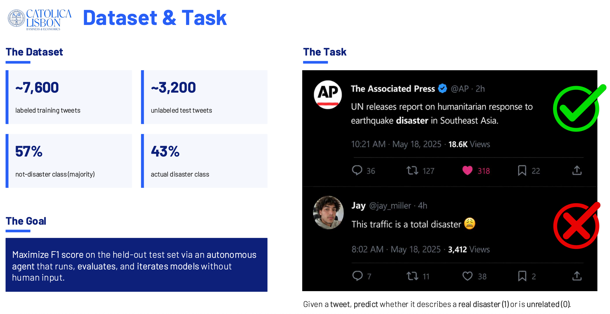
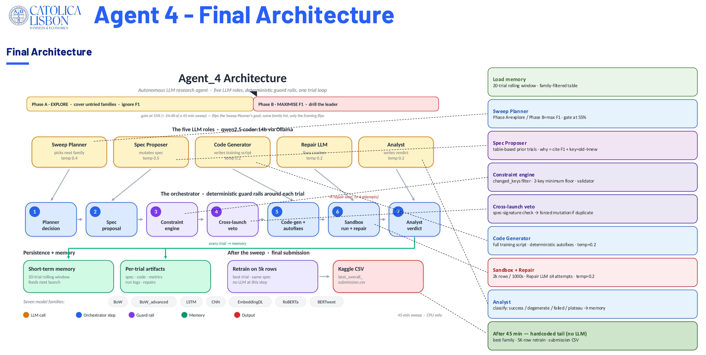
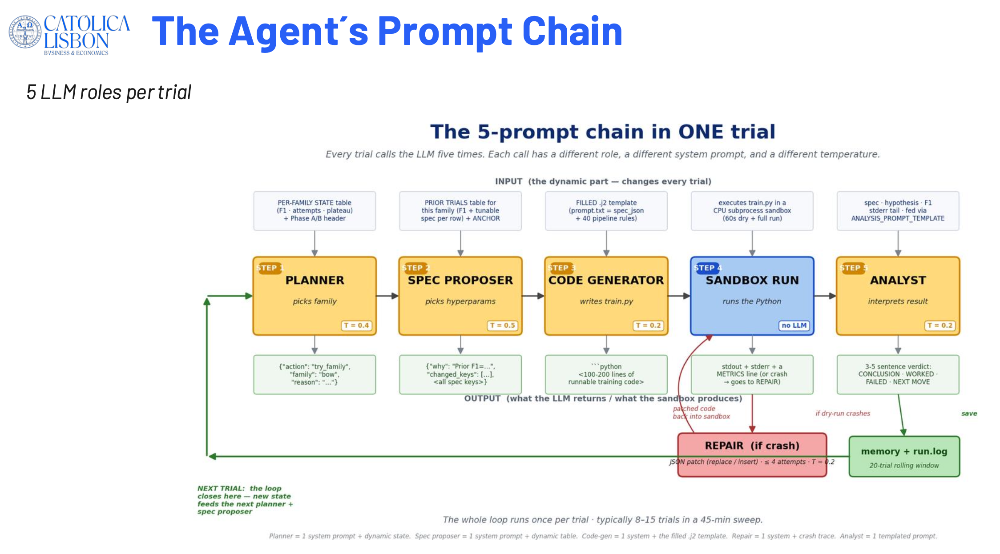
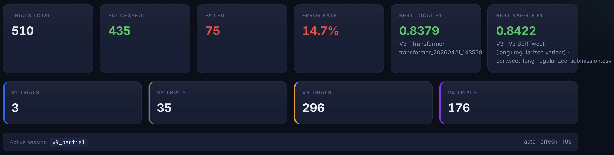
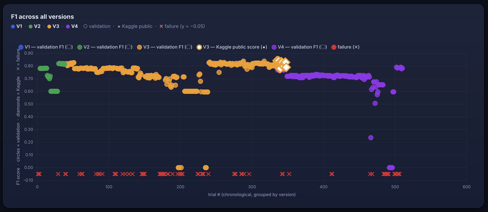
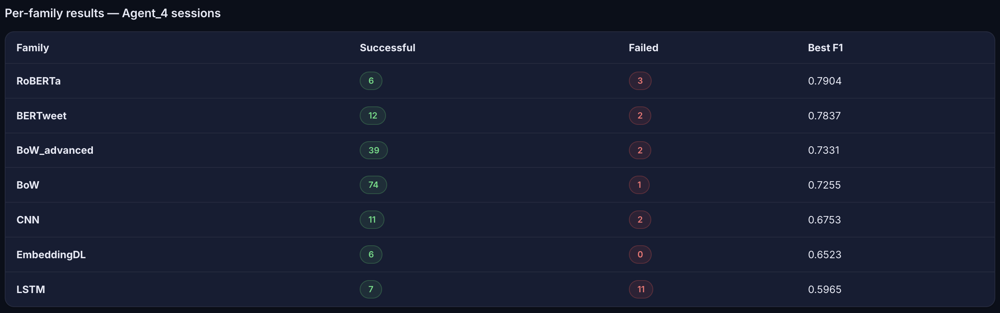
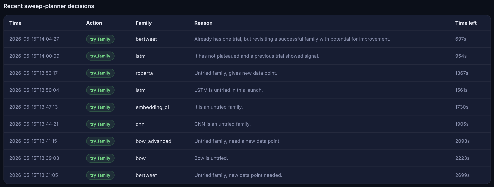

# Disaster Tweets — Autonomous LLM Research Agent

An autonomous LLM agent that proposes, generates, executes, and evaluates ML experiments on the Kaggle [NLP with Disaster Tweets](https://www.kaggle.com/competitions/nlp-getting-started) binary classification task — without human intervention after launch. Built as a group project for the Advanced Predictive Analytics course at Católica Lisbon School of Business and Economics (Spring 2026).

**Team:** Niccolò Germani · Simon Gühring · Rahul Rajesh · Dominik Plöchl  
**Course:** Advanced Topics in Predictive Analytics 2025/26 — Católica Lisbon School of Business & Economics

---

## The Task



Given a tweet, predict whether it describes a real disaster (1) or is unrelated (0). The training set contains ~7,600 labelled tweets; performance is evaluated on F1 against a held-out test set of ~3,200 tweets. Rather than building a model manually, we built an agent that runs the entire experiment loop autonomously within a 1-hour CPU-only budget per launch.

---

## Results

| Submission | F1 (Kaggle public) | Notes |
|---|---|---|
| All-time best | **0.84216** | BERTweet, 16-epoch manual retrain on GPU — architecture discovered by agent |
| Best fully-agent-driven | **0.84002** | V3-era BERTweet, CPU only |
| Best V4 agent | **0.83052** | RoBERTa, V4 sweep |

Across all four agent versions: **557 trials logged**, **437 successful** (78% success rate).

---

## Agent Architecture (V4)



The final agent runs a 45-minute sweep structured around five specialised LLM roles and seven deterministic orchestrator steps, all backed by `qwen2.5-coder:14b` via Ollama (CPU only).

**The five LLM roles** (one call each per trial):

| Role | Temperature | What it does |
|---|---|---|
| Sweep Planner | 0.4 | Picks which model family to try next from a live per-family state table |
| Spec Proposer | 0.5 | Proposes hyperparameters for the chosen family, must cite prior F1 |
| Code Generator | 0.2 | Writes the full training script from the validated spec |
| Repair LLM | 0.2 | If the script crashes: returns a JSON diff patch (≤4 attempts) |
| Analyst | 0.2 | Writes a structured verdict after every trial; feeds into next Planner call |

**The two phases** flip at the 55% wall-clock mark:

- **Phase A — EXPLORE:** cover all seven families, ignore F1
- **Phase B — MAXIMISE F1:** drill the current leader with hyperparameter tweaks



**Cross-launch memory** keeps a 20-trial rolling window across launches. A spec-signature hash veto eliminates duplicate experiments.

After 45 minutes: the best trial's script retrains on 5,000 rows (no LLM invoked), predicts the full test set, and writes the Kaggle submission CSV.

---

## Evolution: V1 → V4

Each version fixed the main failure mode of its predecessor.

| Version | Trials | Success rate | Best local F1 | Key improvement |
|---|---|---|---|---|
| V1 | 3 | 0% | — | Monolithic prompt, no repair, all failures |
| V2 | 35 | 97% | 0.821 (DistilBERT) | LLM writes full script; preflight + repair loop |
| V3 | 296 | 83% | 0.838 (DistilBERT) | Two-LLM pipeline; per-family templates; SWEEP→OPTIMIZE→FINAL phases |
| V4 | 223 | 70% | 0.793 (RoBERTa) | Autonomous sweep planner; cross-launch memory; constraint engine |

V4's lower local F1 vs V3 is by design: it trains on a fixed 2,000-row sweep sample (comparable across all families) rather than letting any single family use the full budget. The trade-off is a more honest apples-to-apples comparison between families.

---

## Model Families

Seven families cover every NLP approach in the course syllabus:

| Family | Best V4 F1 | Notes |
|---|---|---|
| RoBERTa | 0.793 | `roberta-base` fine-tuned; top V4 performer |
| BERTweet | 0.791 | `vinai/bertweet-base`; domain-matched tokeniser for tweet text |
| BoW_advanced | 0.730 | TF-IDF word+char n-grams, multi-channel, stacked classifiers |
| BoW | 0.725 | TF-IDF + logistic regression baseline |
| EmbeddingDL | 0.703 | Small GRU over from-scratch embeddings |
| CNN | 0.675 | 1D convolutions as local n-gram detectors |
| LSTM | 0.621 | Gated recurrent network; limited by 7.6k training examples |

Transformers dominate because of pretrained contextual embeddings. From-scratch deep models (CNN, LSTM, EmbeddingDL) underperform the BoW baseline under the compute budget — 7,600 tweets is too small for those embeddings to converge.

---

## Running the Agent

**Prerequisites:** Python 3.11+, [Ollama](https://ollama.com/download) running locally.

```bash
# Start Ollama in a separate terminal
ollama serve

# Clone and run (downloads qwen2.5-coder:14b ~9 GB on first launch)
git clone https://github.com/dplochl/Autonomous-NLP-Agent
cd Autonomous-NLP-Agent

# Add Kaggle data
kaggle competitions download -c nlp-getting-started -p data
unzip data/nlp-getting-started.zip -d data

# Launch (60-min default budget)
./run.sh
```

Useful variants:

```bash
./run.sh --time-budget-minutes 10      # quick smoke run
./run.sh --family bertweet             # one family only
./run.sh dashboard                     # live dashboard at http://localhost:5050
```

**To replay the final submission without re-running the sweep:**

```bash
./.venv/bin/python replay_final_submission.py
```

---

## Outputs

```
submissions/best_overall_submission.csv   # Kaggle submission CSV
logs/agent4_short_term_memory.json        # cross-launch memory (20-trial window)
src/Agent_4/runs/<family>_<ts>/run_NNN/   # per-trial artefacts: spec, code, metrics, repair log
```

---

## Live Dashboard

The agent ships with a live dashboard (`./run.sh dashboard` → `http://localhost:5050`) that visualises all experiment runs in real time.









---

## Stack

Python · scikit-learn · PyTorch · HuggingFace Transformers · Ollama (`qwen2.5-coder:14b`) · Flask (dashboard)  
**Full project report:** [`report.pdf`](report.pdf)
